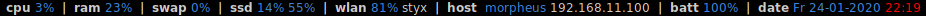
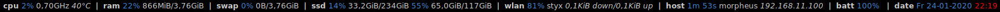
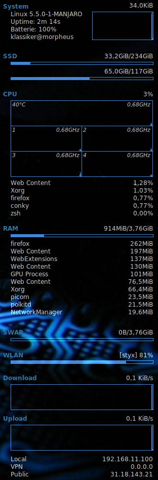

# conky

shell scripts for conky

| name     | comment                              |
| :------- | :----------------------------------- |
| conky.sh | start conky or toggle configurations |

config files: [dotfiles/conky](https://github.com/mrdotx/dotfiles/tree/master/.config/conky)

